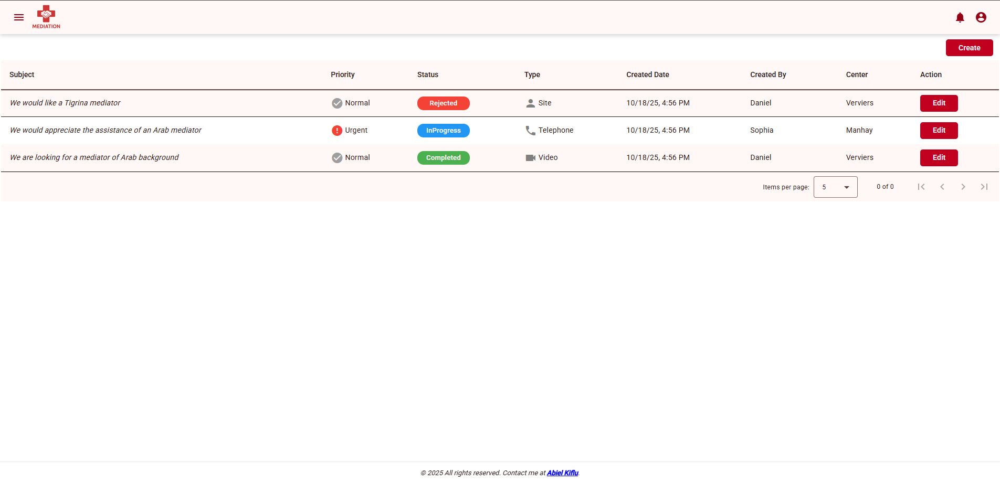
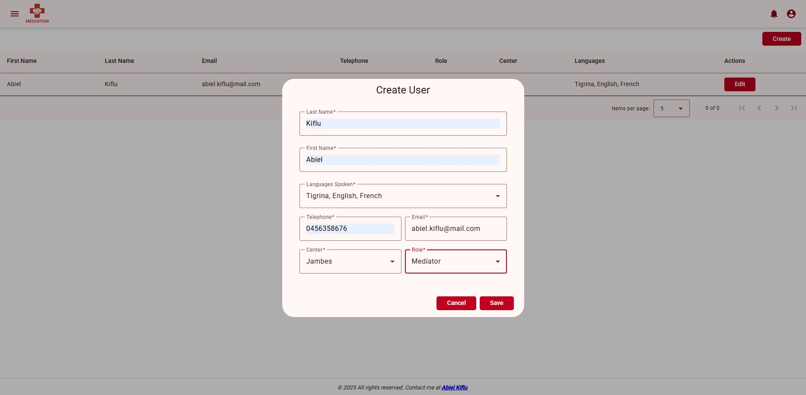
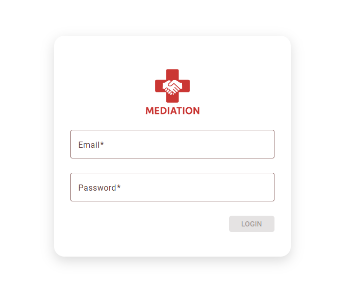

# Mediation Service Management System UI

Angular and material design 19

 

## 🚀 Features (Planned)
- [x] Responsive navigation
- [x] Breadcrumb
- [x] Logo and icon design
- [x] User list(Admin, clients and mediators)
- [ ] User Login form(Gmail/outlook)
- [ ] User Edit form

- [ ] Demand CRUD

- [ ] Integrate maps for centers and mediators live location

- [ ] Guest interaction(residents and workers) show them available mediator in their center 

